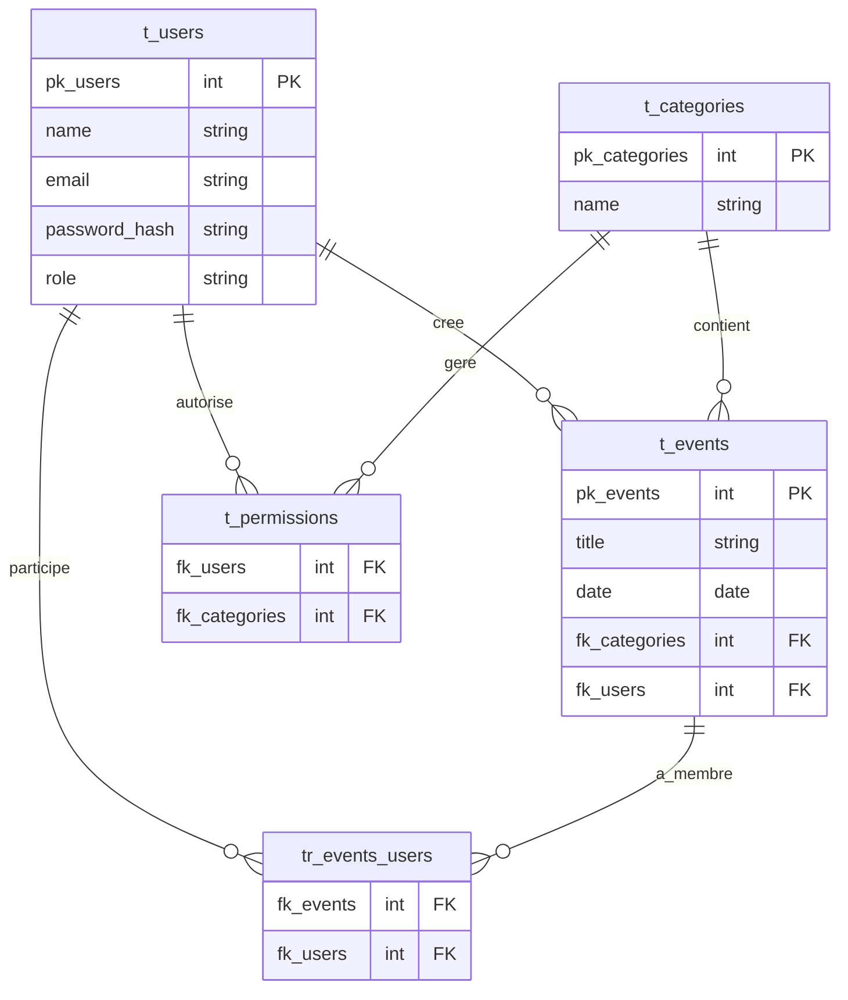

# Documentation de projet - Membora

- Auteur : Valentin Gremaud
- Date de création : 24.05.2025

## ANALYSE

## CONCEPTION

### Diagrammes entités relations

## REALISATION

### Dépendances node

1. pg (postgres)
2. dotenv
3. express
4. cors
5. jsonwebtoken
6. joi
7. 

## DEPLOIEMENT
