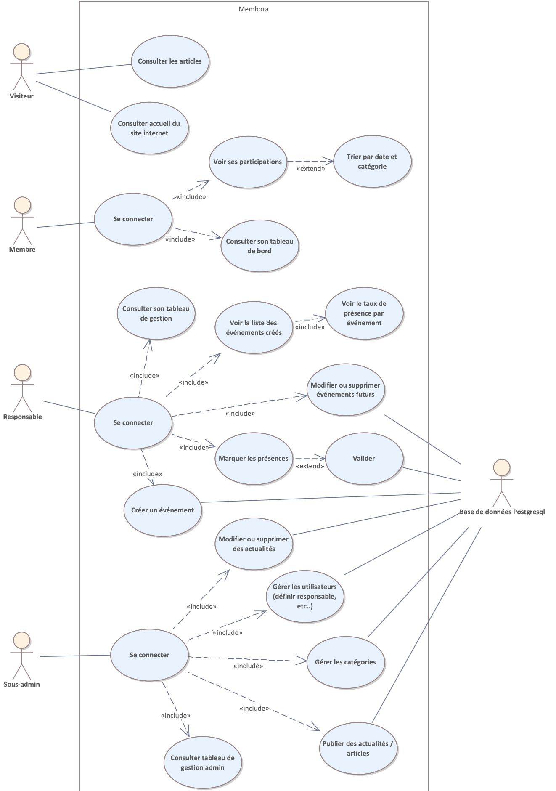
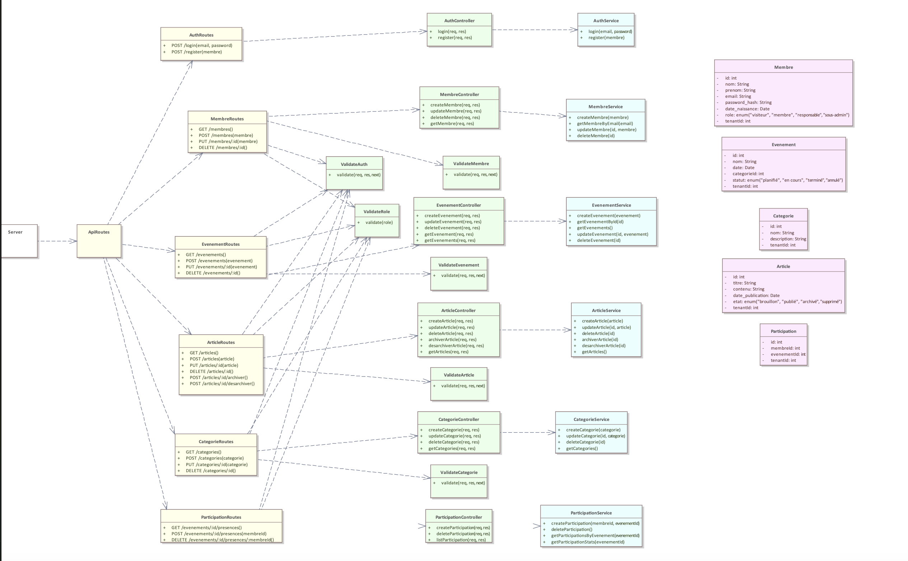
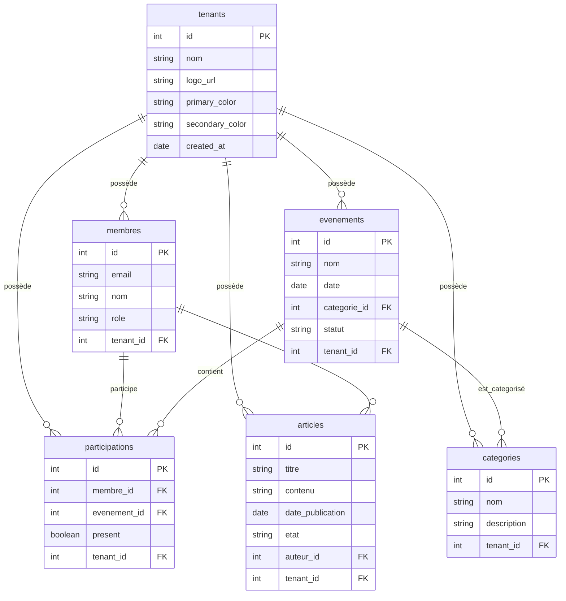

# Documentation de projet - Membora

- Auteur : Valentin Gremaud
- Date de création : 24.05.2025

## ANALYSE

### But du projet

**Membora** est une application web de gestion d'événements et de participation pour des sociétés. Elle permet de :

**Pour les membres :**

- Suivre leurs participations aux événements
- Consulter leur historique de présence par catégorie et date
- Calculer automatiquement leur réduction basée sur leur participation
- Télécharger des attestations de participation

**Pour les responsables :**

- Créer et gérer des événements (titre, date, description, catégorie)
- Marquer les présences des membres lors des événements
- Suivre les taux de participation par événement
- Modifier ou supprimer des événements futurs

**Fonctionnalités générales :**

- Système d'authentification avec rôles (membre/responsable)
- Interface adaptée selon le rôle de l'utilisateur
- Gestion des catégories d'événements avec permissions
- Calcul automatique des réductions basé sur la participation

L'application vise à simplifier la gestion administrative des associations en automatisant le suivi des présences et le calcul des avantages pour les membres.

### Glossaire et définitions

### Contraintes et hypothèses

### Personas / profils utilisateurs

### Les différents rôles dans le projet

**Visiteur**

- Peut consulter le site internet
- Peut lire les articles publiés sur le site

**Membre**

- Utilisateur standard de l'application
- Peut consulter son tableau de bord personnel
- Accès en lecture seule à ses données de participation
- Peut filtrer et trier son historique de présence
- Peut télécharger des attestations de participation
- Voit automatiquement sa réduction calculée

**Responsable**

- Utilisateur avec droits de gestion
- Peut créer, modifier et supprimer des événements
- Peut marquer les présences des membres
- Accès au tableau de gestion avec statistiques
- Peut consulter les taux de participation par événement
- Gère les catégories d'événements

**Sous-admin**

- Gère les utilisateurs (définit responsable, etc...)
- Gère les catégories d'événements
- Publie les articles/actualités du site
- Modifie et supprime les articles
- Consulter son tableau de gestion

### Fonctionnalités essentielles

### Planning

`À définir`

### Technologies du projet

#### Frontend

- **Framework** : Next.js (utilisant React)
- **Styling** : Tailwind CSS (proposé pour un design moderne et rapide)
- **Gestion d'état** : React Context API (pour `AuthContext` par exemple)

#### Backend

- **Environnement** : Node.js
- **Framework** : Express.js
- **Base de données** : PostgreSQL
- **Authentification** : `jsonwebtoken` (JWT)
- **Sécurité** : `bcrypt` (hachage de mots de passe)
- **Validation** : `joi` (validation des données d'entrée)
- **API** : `cors` (gestion des accès Cross-Origin)
- **Configuration** : `dotenv` (gestion des variables d'environnement)

## CONCEPTION

### Diagramme de use cases

### Diagramme de séquence

### Diagramme d'état

### Diagramme de classes UML

### Diagramme d'entités relation

### Spécification des API

### Spécification des validations

### Architecture des dossiers

#### Client

Pour le frontend avec Next.js et Tailwind CSS, nous adopterons une architecture modulaire et évolutive basée sur le `App Router`. Cette structure favorise la séparation des préoccupations et la réutilisabilité des composants.

- `client/`
  - `app/`: Cœur de l'application (App Router de Next.js).
    - `(auth)/`: Groupe de routes pour l'authentification.
      - `login/page.jsx`
      - `register/page.jsx`
    - `(main)/`: Groupe de routes pour les pages principales de l'application.
      - `dashboard/page.jsx`
      - `events/page.jsx`
      - `events/[id]/page.jsx`
      - `layout.jsx` (layout commun avec barre de navigation, etc.)
    - `api/`: Contient les _route handlers_ de Next.js, si nous décidons de créer un BFF (Backend For Frontend).
    - `components/`: Composants React réutilisables.
      - `ui/`: Petits composants d'interface (Button, Input, Card), souvent gérés par `shadcn/ui`.
      - `shared/`: Composants partagés entre plusieurs pages (Navbar, Footer).
      - `forms/`: Formulaires complexes (EventForm, LoginForm).
    - `contexts/`: Contextes React pour la gestion d'état global (ex: `AuthContext.jsx`).
    - `hooks/`: Hooks personnalisés (ex: `useAuth.js`).
    - `lib/` ou `utils/`: Fonctions utilitaires, helpers et configuration de librairies.
    - `layout.jsx`: Layout racine de l'application.
    - `page.jsx`: Page d'accueil.
    - `globals.css`: Fichier pour les styles globaux et les directives `@tailwind`.
  - `public/`: Ressources statiques (images, polices, icônes).
  - `tailwind.config.js`: Fichier de configuration pour Tailwind CSS.
  - `next.config.mjs`: Fichier de configuration de Next.js.
  - `package.json`: Dépendances et scripts du projet.

#### Backend

Pour le backend avec Node.js et Express.js, nous utiliserons une architecture inspirée du modèle MVC (Modèle-Vue-Contrôleur) pour garantir une séparation claire des responsabilités.

- `server/`
  - `src/`
    - `api/` (ou `routes/`): Définit les routes de l'API (`/users`, `/events`) et les associe aux contrôleurs correspondants.
    - `controllers/`: Reçoivent les requêtes HTTP, valident les données (souvent avec l'aide de middlewares), appellent les services métier et renvoient la réponse au client.
    - `services/`: Contiennent la logique métier principale et complexe. Ils sont appelés par les contrôleurs.
    - `models/` (ou `db/`): Gèrent l'interaction avec la base de données PostgreSQL. Contiennent les requêtes SQL et la logique de manipulation des données.
    - `middlewares/`: Fonctions qui s'exécutent entre la requête et le contrôleur. Idéal pour l'authentification (vérifier un JWT), la validation (avec Joi) ou la gestion des logs.
    - `config/`: Fichiers de configuration pour la base de données, les clés secrètes, etc.
    - `utils/`: Fonctions utilitaires réutilisables qui ne dépendent pas du reste de l'application.
  - `.env`: Fichier pour stocker les variables d'environnement (non versionné).
  - `index.js` (ou `server.js`): Point d'entrée de l'application. Il initialise Express, connecte la base de données, applique les middlewares et démarre le serveur.
  - `package.json`: Dépendances et scripts du projet.

### Wireframes / maquettes

### Use Cases

| Rôle               | Cas d'utilisation                                        | Relation | Notes techniques (React / MVC)                       |
| ------------------ | -------------------------------------------------------- | -------- | ---------------------------------------------------- |
| **Tous**           | Se connecter avec rôle                                   | —        | Login form + AuthContext                             |
|                    | Accès conditionné par rôle                               | include  | `PrivateRoute`, logique conditionnelle               |
| **Membre**         | Consulter le tableau de bord                             | include  | Page `DashboardMembre.jsx`                           |
|                    | Visualiser ses participations                            | include  | `services/attendanceService.js`                      |
|                    | Trier ses participations par catégorie / date            | extend   | Composant filtrant (`<Select>`, `<Table>`)           |
|                    | Voir sa réduction calculée                               | include  | `utils/calcReduction.js`                             |
|                    | Télécharger une attestation de participation (texte)     | extend   | Simuler PDF ou simple `div printable`                |
| **Responsable**    | Consulter son tableau de gestion                         | include  | `DashboardResponsable.jsx`                           |
|                    | Créer un événement (titre, date, description, catégorie) | —        | Formulaire `EventForm.jsx`, service de création      |
|                    | Voir la liste des événements créés                       | —        | `eventsService.getByCreator()`                       |
|                    | Marquer les présences                                    | —        | Checkbox dynamique par membre + enregistrement       |
|                    | Modifier ou supprimer un événement                       | extend   | Condition : événement non passé                      |
|                    | Voir le taux de présence par événement                   | extend   | Calcul simple dans `services/attendance`             |
| **Backend simulé** | Utilisateurs JSON simulés                                | —        | `data/users.json`                                    |
|                    | Événements JSON simulés                                  | —        | `data/events.json`                                   |
|                    | Présences JSON simulées                                  | —        | `data/attendance.json`                               |
| **Structure**      | Architecture MVC en React                                | —        | `pages/`, `services/`, `components/`, `utils/`, etc. |
|                    | Routing avec React Router                                | —        | `App.jsx`, `routes.jsx`                              |
|                    | AuthContext global                                       | —        | `context/AuthContext.jsx`                            |

## REALISATION

### Technologies utilisées

### Découpage des user stories

### Plan de tests

### Screenshots

### Dépendances node

1. pg (postgres)
2. dotenv
3. express
4. cors
5. jsonwebtoken
6. joi
7. bcrypt

## DEPLOIEMENT

### Procédure d'installation

### Procédure de mise en production

### Sécurité et sauvegarde

## MAINTENANCE

### Journal des versions

### Bugs connus

### Améliorations futures
